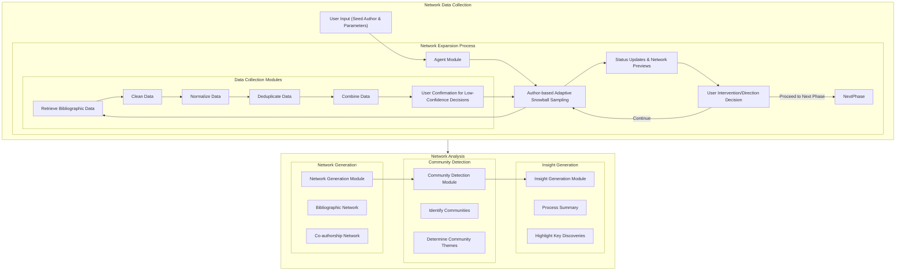

# Japanese Biblio Explorer

**THIS IS A WORK-IN-PROGRESS.**

## Introduction

An AI-powered research assistant that collaborates with researchers to retrieve bibliographic data from NDL Search and CiNii, create coauthorship networks, and detect communities. Initially developed for revealing the historical development of interdisciplinary communities in postwar Japan, it can be used by researchers from other fields including sociology, politics, and science of science.

## Philosophy of Design

Japanese Biblio Explorer aims to realize a symbiotic relationship between researcher and generative AI agent. Rather than pursuing a high degree of automation, the tool emphasize the researcher's synergic involvement in data collection and analysis. Tasks involve cooperation between researcher and the program includes are not limited to combining data collections, changing search directions, data cleaning, and iterative network expansion. This symbiotic approach enables the researcher to guide the investigation based on their domain expertise and reduce errors caused by AI and low data quality.

## Highlights and key contributions

1. A new tool works in both GUI and command line modes for exploring the bibliographic data in NDL Search and CiNii.
2. A new author-based adaptive snowball sampling method that can avoid exponential growth in data colleciton and efficiently detects communities centered on the seed author or at a distance from the seed author.
3. An experiment on a symbiotic relationship between researcher and generative AI that allows the researcher to control the algorithm.
4. Highly modulized design that allows the reuse of part or the entire tool for developing other tools.

## Workflow

1. **Network Data Collection**:
   - **Network Expansion**: After the user provides a seed author and other filtering parameters, the Agent Module iteratively expands the network by discovering co-authors using an author-based adaptive snowball sampling method. It can be configured to present the status of exploration periodically, generate previews of coauthorship network, and ask the user to decide the future direction. The user can also pause and step in if necessary.
   - **Data Collection and Processing**: Commanded by the agent module, the Data Collection Modules retrieve, clean, normalize, deduplicate, and combine bibliographic data from the designated sources. The user will be asked for confirmation when the generative AI cannot make a high-confidence decision.
2. **Network Analysis**
   - **Network Generation**: Generate bibliographic and co-authorship networks.
   - **Community Detection**: Identify communities and their themes.
   - **Insight Generation**: Summarize the whole process and highlight discoveries.



## Modules and Progress

### Data Collection Modules (*DONE*)

These modules handle the collection, pre-processing, and storage of bibliographic data:

#### NDL Search Module
- **`ndl_search_retriever.py`**: Retrieves bibliographic items from the [NDL Search API](https://ndlsearch.ndl.go.jp/help/api/specifications)
  - **Features**:
    - Multiple query modes: by keywords in title, by creator, or by NDC code
    - Customizable time range parameters
    - XML data extraction and JSON conversion

#### CiNii Module
- **`cinii_search_retriever.py`**: Interfaces with CiNii Research's [OpenSearch API](https://support.nii.ac.jp/ja/cir/r_opensearch)
  - **Features**:
    - Parallel functionality to NDL module
    - Standardized output format for consistency

#### Data Processing Module
- **`data_processor.py`**: Contains the `BiblioDataProcessor` class for cleaning and normalizing retrieved data
  - **Features**:
    - Data normalization for dates, authors, and publishers
    - Duplication removal
    - SQLite database storage with relational tables
    - Entity identification and categorization

### Agent Module (*IN-PROGRESS*)

**`agent.py`**: The core intelligent component that orchestrates data collection for the network:

- **Configuration Options**:
  - Database selection (NDL Search, CiNii, or both)
  - Initial seed author and filtering parameters (keywords, date ranges, etc.)
  - Network expansion parameters (depth, max authors)
    - Priority calculation settings to balance depth-based and overlap-based author selection

- **Database Management**:
  - Creates or continues with existing database files
  - Tracks network expansion metadata and status

- **Network Expansion Process**:
  - Uses adaptive snowball sampling with priority-based author selection
  - Calculates author priorities based on network depth and co-authorship overlaps
  - Provides periodic status updates and visualizations
  - Terminates based on configurable conditions (depth limit, author count, etc.)

- **Output**:
  - Generates tree diagrams and network representations
  - Produces standardized graph formats for further analysis

### Social Network Analysis Modules (*TODO*)
- Creation of co-authorship network, etc.
- Analysis of the co-authorship networks:
  - **Community detection algorithms**
  - **Centrality measures** to identify key researchers
  - **Temporal analysis** of collaboration patterns
  - **Visualization components** for network exploration

### GUI Modules (*IN-PROGRESS*)
The GUI components:
  - **`biblio_explorer_gui.py`**: Main application interface
  - **`cinii_search_wrapper.py`**: UI wrapper for CiNii search functionality
  - **`ndl_search_wrapper.py`**: UI wrapper for NDL search functionality
  - **`data_processor_wrapper.py`**: UI wrapper for data processing operations

## Installation

```bash
# Clone the repository
git clone https://github.com/foxal/biblio_explorer.git
cd biblio_explorer

# Set up virtual environment
python -m venv venv
source venv/bin/activate  # On Windows: venv\Scripts\activate

# Install dependencies
pip install -r requirements.txt
```

## Usage

### GUI Mode
```bash
# Launch the GUI application
python biblio_explorer_gui.py
```

### Command Line Mode
The agent can also be run in command-line mode for network creation:

```bash
# Run agent with basic parameters
python agent.py --person 林雄二郎 --depth 2

# Run agent with advanced parameters
python agent.py --database cinii --person 林雄二郎 --start_year 1960 --end_year 1970 --priority_depth 0,1 --max_authors 50
```

Run `python agent.py --help` to see all available command-line options.

### API Key Setup

To use the AI feature, you'll need to set up an OpenAI API key:

1. Sign up for an API key at [OpenAI](https://platform.openai.com/)
2. Set the API key using one of these methods:
   - **Environment variable**: Set the `OPENAI_API_KEY` environment variable
   - **Configuration file**: Copy `.env.template` to `.env` and add your API key

> **Important**: Never commit your API key to version control. The `.env` file is already in `.gitignore` to prevent accidentally exposing your key.

## Requirements

- Python 3.8+
- PyQt6 (for GUI)
- Requests
- SQLite3 (included in Python standard library)
- inputimeout
- OpenAI

## Contributing

Contributions are welcome after the "work-in-progress" mark disappears.

## License

This project is licensed under the MIT License - see the [LICENSE](LICENSE) file for details.
